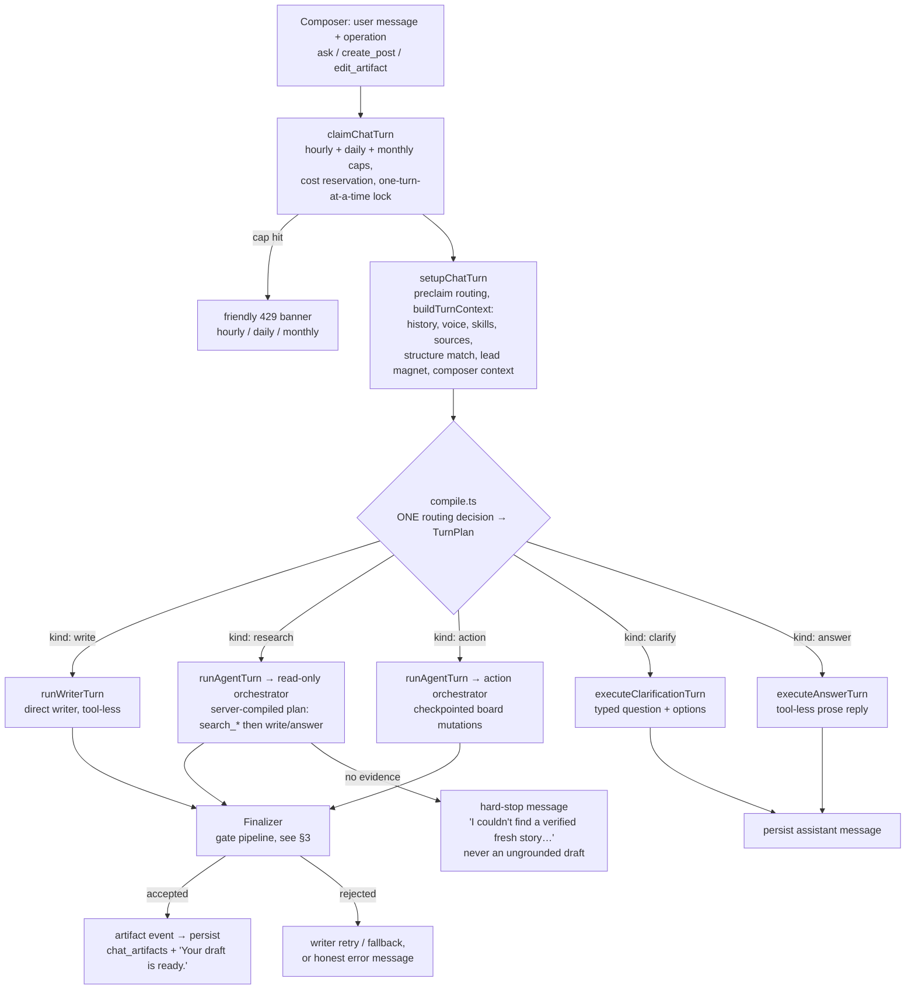
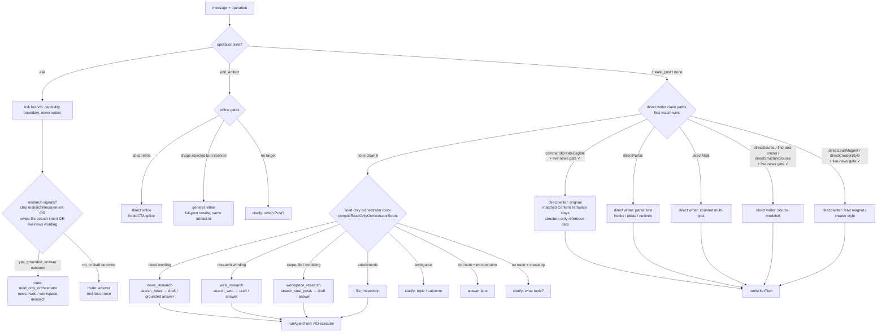
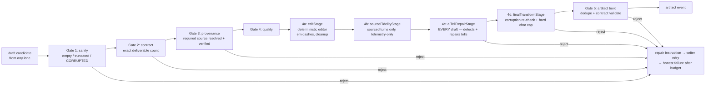

# Cowork turn pipeline: prompt → post, with every ramification

A map of every step a chat message takes from the composer to a delivered
Post, every branch it can take, and — the point of this doc — **where
plug-in "agents" (deterministic nets and model specialists) attach**, so
adding a new one (like the AI-tell repair) is a mechanical exercise instead
of an archaeology dig.

Everything below is grounded in code, not folklore. Entry points:

- `lib/agent/rate-limit.ts` — turn claim + cost caps
- `lib/agent/turn/setup.ts`, `preclaim-routing.ts`, `context.ts` — setup
- `lib/agent/turn/compile.ts` — the routing decision (one place)
- `lib/agent/turn/execute.ts` — executor dispatch
- `lib/agent/execute/writer.ts`, `lib/agent/execute/agent.ts` — executors
- `lib/agent/finalize/*` — the finalizer gates
- `lib/agent/specialists/nets.ts` — deterministic nets library

---

## 1. End-to-end skeleton

Hard invariants worth knowing before plugging anything in:

- **Exactly one place routes.** `compile.ts` produces a `TurnPlan`
  (`kind` + `route`); executors only execute. If a turn reaches the wrong
  executor, the bug is in compile's gates, not in the executor.
- **Every lane that produces a Post goes through the finalizer.** There is
  no side door. That is why finalizer nets (corruption, AI tells) are the
  strongest place to plug in quality guarantees.
- **A failed search hard-stops; it never falls back to an ungrounded
  write.** If you see an ungrounded draft from a research request, some
  direct lane claimed the turn before the research route could (this has
  happened twice — see the routing gates below).

---

## 2. The routing decision tree (all ramifications)

Order matters: each gate can claim the turn and stop evaluation. The
live-news/research gate (`requiresLiveNewsOrResearch`) is called out
explicitly because newsjacking historically leaked past it.

The direct-writer claim paths each need the **same** unsafe-intent gates.
When a new claim path is added, it must reject:
`requiresLiveNewsOrResearch` (newsjack/breaking/research wording), compound
deliverables, partial+post mixes, durable actions, unresolved references.

Automatic Content Template matching does not turn an original request into a
source-modeled request. Setup reuses the matcher result already computed for the
turn, keeps the highest-ranked workspace or built-in Content Template, and
passes it to the original writer as untrusted structure-only reference data.
This adds no model call or drafting pass. Source Posts are never silently
substituted for a Content Template in this path.

The two times a newsjack shipped ungrounded garbage, it was a claim path
missing exactly this gate (`commandCreateEligible` in #1568,
`directStructureSource` in #1579).

**Central gate (create-family lanes).** Since the per-lane gates have been
missed twice, `useDirectWriter` now also enforces the invariant in one
place: when *only* create-family lanes claim and the instruction demands
live news/research, the direct writer loses regardless of what the
individual gates say. It is a deliberate no-op on every input reachable
today (all create lanes already reject those instructions) — it exists so
the next claim path inherits the gate instead of remembering it. Refine
lanes are exempt (editing a draft never needs a search). The invariant is
pinned by `evals/data/direct-writer-gate-invariants.test.ts`, which fails
CI if the central gate or any per-lane gate loses the predicate.

---

## 3. The finalizer gate pipeline (plug-in points)

Every Post candidate — from any lane — passes these gates in order. A
rejection routes back to the writer as a repair instruction; repeated
rejection ends the turn with an honest error, never a bad artifact.

### Writer-side short-circuits (before the finalizer)

In `lib/agent/execute/writer.ts` `finalize()`, before the finalizer runs:

- `looksLikeRefusalOrClarification(body)` — a writer answering with a
  refusal/options-menu instead of a post is delivered as **chat text** with
  `terminalReason: "ask"`, never as an artifact.

---

## 4. The plug-in registry (what exists today)

Deterministic nets live in `lib/agent/specialists/nets.ts` (pure, unit-tested).
Model specialists live in `lib/agent/specialists/` and are injected through
`DraftFinalizerSpecialists` (`lib/agent/finalize/finalizer.ts`) so tests can
stub them.

| Plug-in | Type | Attach point | Fires on | On failure |
|---|---|---|---|---|
| `looksCorruptedDraft` | net | Gate 1 + Gate 4d + repair output validation | leaked fences, JSON fragments, tool-call XML, **simulated tool calls as body** | candidate rejected → writer re-renders |
| `looksLikeRefusalOrClarification` | net | writer finalize (pre-finalizer) | refusal / clarification prose instead of a post | delivered as chat text, `terminalReason: "ask"` |
| `stripEmDashes` | net (rewrite) | deterministic editor (Gate 4a) | em-dash AI tell (voice-aware: suppressed for em-dash writers) | never rejects; rewrites |
| `aiTellMetrics` | net (detect) | `repairAiTells` trigger + repair output validation + Gate 4c | 20+ tell families: rule-of-three, repeated-opener, negative-parallelism, signposting, colon-reveal, ai-vocabulary… | triggers repair, then blocks delivery if any tell remains |
| `repairAiTells` | model specialist (forced-tool copy edit) | Gate 4c, **every draft** | any detected tell | repaired body must score 0 tells, ≤1.4× length, uncorrupted; if repair fails, Gate 4c rejects the candidate and sends a targeted retry instruction to the writer |
| `reviewSourceFidelity` | model specialist | Gate 4b, sourced turns only | grounded draft review | **telemetry-only**, never rejects |
| `checkSameness` | model specialist | multi-draft sets (batch coordinator, off the blocking path) | near-duplicate variations | rewrite or reject the duplicate |
| `rationaleTooGeneric` | net | draft meta.rationale | generic "why I wrote it" captions | caption dropped, draft unaffected |
| `areDraftsNearDuplicate` | net | multi-draft sets | same draft re-worded | duplicate rejected |

## 5. Recipe: adding a new plug-in agent

Using "remove AI tells" as the worked example — this is the play to run for
any new quality task (fact-density, reading level, brand bans, …):

1. **Decide net vs specialist.** A deterministic pattern → a pure function
   in `nets.ts` (free, instant, unit-testable). Judgment call → a forced-tool
   model specialist in `specialists/` (costed, needs validation + timeout +
   a fallback that fails safe).
2. **Detection first.** Add the detector to `aiTellMetrics` (or your own
   net) with precision tests: the exact shipped garbage fires, clean prose
   doesn't. Every false positive eats a good draft — bias to recall last.
3. **Pick ONE attach point.** Quality of body text → finalizer Gate 4
   (covers every lane automatically). Conversational misbehavior → writer
   finalize short-circuit. Routing-level misuse → a gate in
   `compile.ts`'s claim paths (and add it to every sibling claim path —
   partial fixes there are how newsjacking escaped twice).
4. **Fail safe.** Reject → repair instruction to the writer (finalizer
   handles this for you). Rewrite → must be deterministic and never grow
   the draft. Model call → validate output against the same nets; on error,
   ship original + log, never ship garbage.
5. **Tests at three levels.** Detector unit tests (`agent-nets.test.ts`),
   stage/finalizer wiring test (`draft-finalizer.test.ts`,
   `finalizer-stages.test.ts`), and one end-to-end harness scenario
   (`cowork-outcome-harness.test.ts`) proving the whole turn behaves.
